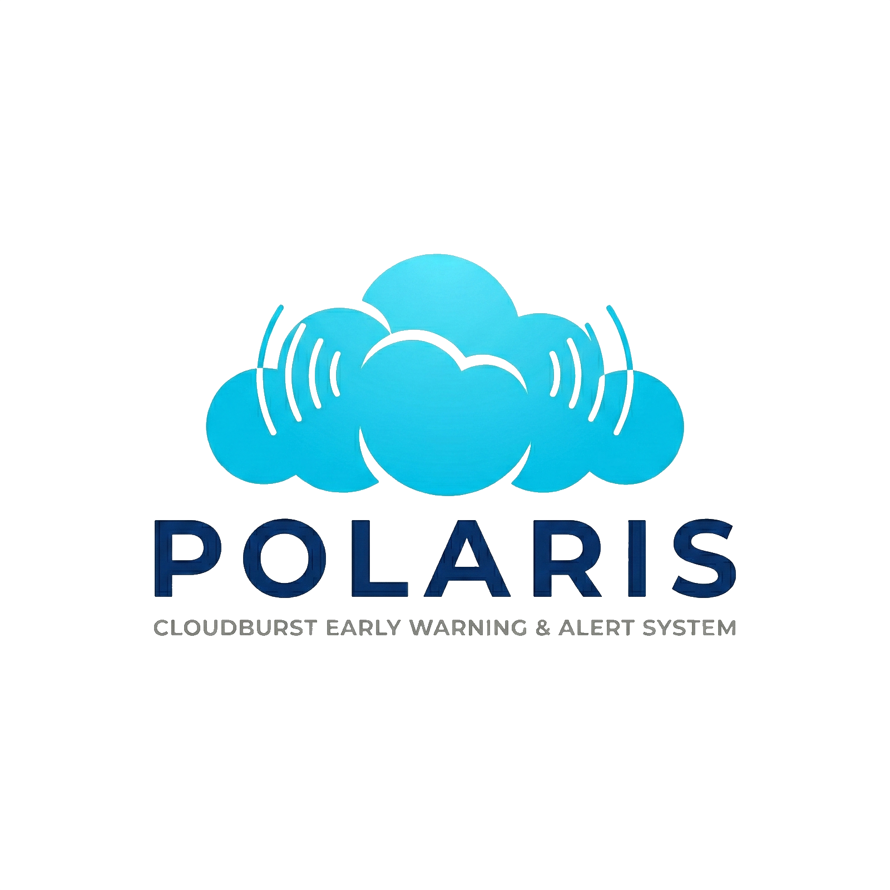

# **Polaris** - Cloudburst Early Warning & Alert System

| **Current Version** | `v0.2: Pre-Release` |
| --- | --- |



---

> **An AI-powered, real-time, hyperlocal cloudburst early warning system**  
> combining **computer vision**, **temporal intelligence**, and **human-in-the-loop safety**.

---

## Overview

**Polaris** is a research-grade early warning system designed to detect **cloudburst-like conditions before severe impact occurs**.  
Unlike traditional threshold-based systems, Polaris uses a **layered intelligence approach** that fuses:

- Visual understanding of the sky  
- Temporal pattern learning  
- Citizen-ground reports  
- Rule-based safety logic  

The result is a **trustworthy, explainable, and deployable** disaster-support system.

---

## System Architecture

```
Camera / Images
      ↓
Image Feature Extraction
(Brightness • Entropy • Edges)
      ↓
Rule-Based Risk Logic
      ↓
Time-Series Spike Detection
      ↓
CNN (Spatial AI)
      ↓
LSTM (Temporal AI)
      ↓
Citizen Input Fusion
      ↓
Safe Decision Fusion
(Never Downgrade)
      ↓
Final Risk Level + Confidence
      ↓
MongoDB + Dashboard APIs
```

---

## Key Capabilities

### Vision-Based Detection
- Camera-based sky monitoring (currently laptop camera)
- CNN learns cloud and storm visual patterns
- Works even before rainfall begins

### Temporal Intelligence
- LSTM model learns **how conditions evolve**
- Detects **rapid escalation**, not isolated frames
- Significantly reduces false positives

### Citizen Intelligence
- Citizen-uploaded images
- Water-level reports (Ankle / Knee / Waist)
- Human inputs can **safely override AI**

### Explainable Decisions
Every prediction includes:
- Risk score
- Risk level
- Confidence score
- AI probability (CNN)
- Temporal probability (LSTM)

This ensures **auditability and trust** for authorities.

---

## Notification & Alert Routing

- API-based **alert routing system** triggered by AI decisions  
- Severity-based alert handling:
  - **INFO** – No alert
  - **WARNING** – Notification dispatched
  - **EMERGENCY** – High-priority alert
- Designed for **Postman-based testing** and easy integration with external systems

---

## Authority Feedback Loop

- Alerts can be marked as:
  - TRUE_POSITIVE
  - FALSE_POSITIVE
  - LATE_DETECTION
- Feedback stored for **future retraining and evaluation**

---

## AI Models Used

### Spatial AI (CNN)
- Architecture: **MobileNetV2**
- Task: Identify high-risk cloud patterns
- Output: Probability of high-risk frame

### Temporal AI (LSTM)
- Input: Sequences of numeric features
- Learns escalation trends across time
- Core component for early warning

> ⚠️ Rule-based logic is **never removed** and always acts as a safety fallback.

---

## Data Storage (MongoDB)

Collections:
- `alerts` – alert metadata  
- `images` – image metadata  
- `predictions` – risk, confidence, AI outputs  
- `citizen_reports` – public inputs  
- `feedback` – authority verification  

---

## Dashboard & System APIs

### Dashboard APIs
- `/dashboard/risk-timeseries`
- `/dashboard/confidence-timeseries`
- `/dashboard/current-status`

### Core System APIs
- `GET  /decision/latest` – Fetch latest AI decision  
- `POST /alert/dispatch` – Dispatch alert payload  
- `POST /input/camera` – Camera image input  

Compatible with:
- React
- Streamlit
- Grafana
- Power BI

---

## Postman Integration

- All core APIs are testable via **Postman**
- Used for **live decision → alert validation**
- Enables backend testing without frontend dependency

---

## Project Structure

```
Polaris/
├── app/
│   ├── main.py
│   ├── database.py
│   ├── routes/
│   ├── utils/
│   ├── ai/
│   └── notifications/
│       ├── thresholds.py
│       ├── alert_engine.py
│       ├── router_client.py
│       └── test_alert_engine.py
├── polaris_dataset/
├── camera_client.py
└── README.md
```

---

## Technology Stack

| Layer | Technology |
|------|-----------|
| Backend | FastAPI |
| AI / ML | PyTorch, TorchVision |
| Computer Vision | OpenCV |
| Temporal Learning | LSTM |
| Database | MongoDB |
| Notifications | API-based (Postman / HTTP) |
| Deployment | Cloud-ready |

---

## Team

<a href="https://github.com/HarshBavaskar/Polaris/graphs/contributors">

</a>  

##

- **Detection & AI System** – *Harsh Bavaskar*  
  (CNN, LSTM, rule-based logic, data collection, detection pipeline)

- **Warning & Notification System** – *Anisa D'souza*  
  (API routing, alert logic, Postman integration)
---


## Project Status

- ✅ Detection pipeline complete
- ✅ CNN + LSTM integrated
- ✅ Citizen & authority feedback loop
- ✅ Dashboard-ready APIs
- ✅ Notification & alert dispatch system integrated
- 🔄 Continuous data collection & learning

---

## Future Roadmap

- Hyperlocal sensor fusion (rainfall, humidity, pressure)
- Multi-camera zone mapping
- Transformer-based temporal models
- Mobile apps for citizens & field authorities
- Pilot deployments with local authorities

---

## Disclaimer

Polaris is an **early warning support system** and does not replace official meteorological agencies.  
It is intended to **assist disaster response** with faster, hyperlocal insights.

---
## What Makes Polaris Different

- Not a black-box AI
- Human-in-the-loop by design
- Time-aware, not frame-based
- Built for **trust, safety, and real-world deployment**

---

> *Polaris aims to detect danger early — when response still matters.*
