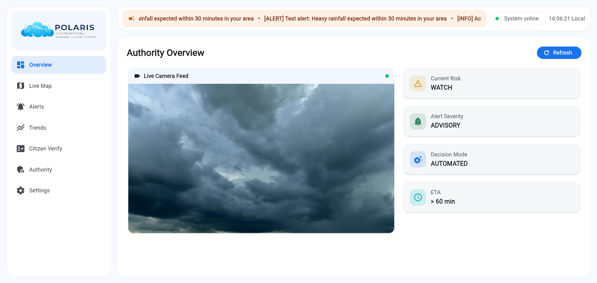

<div align="center">


| **Current Version** | `v0.7A: Authority Platform & UX Overhaul Update` |
| --- | --- |

</div>

---

> **An AI-powered, real-time, hyperlocal cloudburst early warning and decision system**  
> combining **computer vision**, **temporal intelligence**, and **human-in-the-loop authority**.

---

## Overview

**Polaris** is a research-grade early warning and decision system designed to detect **cloudburst-like conditions before severe impact occurs**.  
Unlike traditional threshold-based systems, Polaris uses a **layered intelligence approach** that fuses:

- Visual understanding of the sky  
- Temporal pattern learning  
- Citizen-ground reports  
- Rule-based safety logic  
- Authority override controls  

The result is a **trustworthy, explainable, and deployable** disaster-support system.

---

## What’s New in Polaris v0.7A  
### Major Authority Platform Release

---

## Polaris v0.7A Dashboard UI
<div align ="center">

</div>

---

## Production-Grade Authority Dashboard
- Migrated to a Flutter-based multi-page command center UI:
  - Overview  
  - Live Risk Map  
  - Alerts  
  - Trends  
  - Citizen Verification
  - Authority Controls  
  - Settings
- Fully responsive layouts (desktop + mobile, overflow-safe)
- Custom Polaris branding with system-wide auto refresh
- Rebuilt navigation shell with dynamic top bar (live UTC clock + system status)

---

## Live Situational Awareness
- Embedded live camera feed directly in Overview
- Real-time automatic refresh (no manual reload required)
- Immediate visual context for decision-makers

---

## Decision Analytics & Trends
- Fully functional Trends page
- Live backend-driven charts:
  - Risk score evolution  
  - Confidence trends  
  - Alert severity distribution  
- Automatic polling for real-time updates

---

## Real-Time Alerts & Push Notifications
- Reliable alert synchronization across all dashboard views
- Side push notifications for incoming alerts
- Alert history fully aligned with backend state
- Cooldown logic to prevent alert spam

---

## Hardened Authority Controls
- Stable manual override controls:
  - Risk level  
  - Alert severity  
  - Clear override option  
- Override history with full audit trail
- Instant system-wide override propagation
- Clear distinction between `AUTOMATED` and `MANUAL_OVERRIDE`

---

## Advanced Geospatial Intelligence
- Live cloudburst risk heatmap
- Historical incident overlays
- Manual safe-zone creation and visualization
- Auto-focus and pulse highlighting of highest-risk regions
- Backend groundwork for automatic safe-zone detection
- Fixed map risk point color logic

---

## Citizen Reporting & Verification
- Introduced `CitizenReport` model with JSON serialization
- API-integrated citizen report review workflow
- Citizen Verification screen with:
  - Pending report management  
  - Approve / reject actions  
  - Image preview support  

---

## UX and Visual Overhaul
- Rebuilt global theme system with cohesive color architecture
- Modernized cards, inputs, chips, and buttons
- Responsive layout shell (desktop side panel + mobile drawer/bottom nav)
- Added visual shaders and enhanced UI assets
- Added Dark Mode Toggle

---

## Backend Stability & Integration
- Fixed inconsistent API responses and empty payload issues
- Unified decision → alert → UI propagation pipeline
- Strengthened backend-alert-dashboard contracts
- Full Swagger UI compatibility (no Postman dependency)
- Improved real-time messaging reliability

Polaris v0.7A establishes a fully operational, authority-ready early warning command platform with hardened controls, real-time intelligence, and production-grade UX.

---

## System Architecture

```
Camera / Images
↓
Image Feature Extraction
(Brightness • Entropy • Edges)
↓
Rule-Based Risk Logic
↓
Time-Series Spike Detection
↓
CNN (Spatial AI)
↓
LSTM (Temporal AI)
↓
Citizen Input Fusion
↓
Safe Decision Fusion
(Never Downgrade)
↓
Final Decision Authority
(AI OR Manual Override)
↓
Decision Publication (Valkey)
↓
Automated Alert Routing
↓
MongoDB + Dashboard & Map APIs
```

---

## Key Capabilities

### Vision-Based Detection
- Camera-based sky monitoring (currently laptop camera)
- CNN learns cloud and storm visual patterns
- Works even before rainfall begins

### Temporal Intelligence
- LSTM model learns **how conditions evolve**
- Detects **rapid escalation**, not isolated frames
- Significantly reduces false positives

### Citizen Intelligence
- Citizen-uploaded images
- Water-level reports (Ankle / Knee / Waist)
- Human inputs influence risk but do not bypass safety logic

### Dashboard & Visualization
- Production-grade command-center dashboard
- Global auto-refresh (no manual reload)
- Manual override dominance clearly indicated
- Interactive map with:
  - Live risk heatmap
  - Historical cloudburst incidents
  - Safe zones with confidence
- Designed for authority decision-making

### Authority Control (v0.4+)
- Manual authority override with global precedence
- Override applies instantly system-wide
- Fully auditable (author, reason, timestamp)

### Explainable Decisions
Every prediction includes:
- Risk score
- Risk level
- Confidence score
- AI probability (CNN)
- Temporal probability (LSTM)
- ETA, ETA confidence
- Decision mode (AUTOMATED / MANUAL_OVERRIDE)

---

## Authority Feedback Loop

- Alerts can be marked as:
  - TRUE_POSITIVE
  - FALSE_POSITIVE
  - LATE_DETECTION
- Feedback stored for **future retraining and evaluation**

---

## AI Models Used

### Spatial AI (CNN)
- Architecture: **MobileNetV2**
- Task: Identify high-risk cloud patterns
- Output: Probability of high-risk frame

### Temporal AI (LSTM)
- Input: Sequences of numeric features
- Learns escalation trends across time
- Core component for early warning

> ⚠️ Rule-based logic is **never removed** and always acts as a safety fallback.

---

## Data Storage (MongoDB)

Collections:
- `alerts` – alert metadata  
- `images` – image metadata  
- `predictions` – risk, confidence, AI outputs  
- `citizen_reports` – public inputs  
- `feedback` – authority verification  
- `overrides` – manual authority decisions  
- `safe_zones` – automated & manual safe zones  

---

## Dashboard & System APIs

### Dashboard APIs
- `/dashboard/risk-timeseries`
- `/dashboard/confidence-timeseries`
- `/dashboard/current-status`
- `/alerts/latest`
- `/alerts/history`
- `/map/live-risk`
- `/map/safe-zones`
- `/map/historical-events`

### Core System APIs
- `GET  /decision/latest` – Authoritative system decision  
- `POST /alert/dispatch` – Dispatch alert payload  
- `POST /input/camera` – Camera image input  
- `POST /override/set` – Authority override  
- `POST /override/clear` – Clear override  

Compatible with:
- React
- Grafana
- Power BI
- Postman

---

## Notification & Alert Routing

- Triggered by final decisions published via Valkey
- Runs continuously once the system is started
- Manual override always supersedes AI decisions

### Alert Severity Levels
- **INFO** – No alert
- **ADVISORY** – Stay alert
- **ALERT** – Prepare and restrict movement
- **EMERGENCY** – Immediate action required

---

## Postman Integration

- Used strictly for API testing and validation
- Helpful during development and debugging
- Not required for normal automated system operation

---

## Project Structure

```
Polaris/
├── app/
│   ├── main.py
│   ├── database.py
│   ├── lifespan.py
│   ├── routes/
│   │   ├── override.py
│   │   ├── dashboard.py
|   |   ├── camera.py
│   │   ├── map.py
│   │   ├── alerts.py
│   │   ├── decision.py
│   │   └── feedback.py
│   ├── utils/
│   │   ├── final_decision.py
│   │   ├── alert_severity.py
│   │   ├── eta_logic.py
│   │   ├── eta_confidence.py
│   │   ├── safezone_detector.py
│   │   ├── escalation_rules.py
│   │   └── confidence_logic.py
│   ├── ai/
│   │   ├── infer.py
│   │   ├── temporal_infer.py
│   │   ├── train_cnn.py
│   │   └── train_lstm.py
│   ├── notifications/
│   │   ├── thresholds.py
│   │   ├── alert_engine.py
│   │   ├── router_client.py
│   │   ├── valkey_pub.py
│   │   ├── valkey_router.py
│   │   ├── deliver.py
│   │   └── run_all.sh
│   └── models/
│       ├── prediction.py
│       ├── override.py
│       └── safezone.py
├── polaris-dashboard/
│   ├── lib/
│   │   ├── core/
│   │   │   ├── api_service.dart
│   │   │   ├── global_reload.dart
│   │   │   └── models/
│   │   ├── layout/
│   │   │   ├── app_shell.dart
│   │   │   ├── side_nav.dart
│   │   │   └── top_bar.dart
│   │   ├── screens/
│   │   │   ├── overview_screen.dart
│   │   │   ├── map_screen.dart
│   │   │   ├── alerts_screen.dart
│   │   │   ├── trends_screen.dart
│   │   │   └── authority_screen.dart
│   │   └── main.dart
│   ├── assets/
│   │   └── polaris_logo.png
│   └── pubspec.yaml
├── polaris_dataset/
├── camera_client.py
├── CHANGELOG.md
└── README.md

```

---

## Technology Stack

| Layer | Technology |
|------|-----------|
| Backend | FastAPI |
| AI / ML | PyTorch, TorchVision |
| Computer Vision | OpenCV |
| Temporal Learning | LSTM |
| Database | MongoDB |
| Messaging | Valkey (Pub/Sub) |
| Frontend | Flutter (Web) |
| Mapping | OpenStreetMap |
| Deployment | Cloud-ready |

---

## Team

<a href="https://github.com/HarshBavaskar/Polaris/graphs/contributors">

</a>  

##

- **Detection, AI & Dashboard System** – *Harsh Bavaskar*  
  (CNN, LSTM, decision fusion, safe zones, dashboard, geospatial intelligence)

- **Warning & Notification System** – *Anisa D'souza*  
  (Valkey routing, alert logic, notification pipeline, SMS integration)

---

## Project Status

- ✅ Detection pipeline complete
- ✅ CNN + LSTM integrated
- ✅ Citizen & authority feedback loop
- ✅ Final decision authority implemented
- ✅ Manual override system live
- ✅ Live dashboard & geospatial intelligence operational
- ✅ Trends & analytics available
- ✅ Automated alert routing (Valkey)
- 🔄 SMS delivery integration in progress
- 🔄 Continuous data collection & learning

---

## Future Roadmap

- Automated safe-zone verification & confidence decay
- Hyperlocal sensor fusion
- Multi-camera zone mapping
- Mobile apps for citizens & field authorities
- Pilot deployments with local authorities

---

## Disclaimer

Polaris is an **early warning support system** and does not replace official meteorological agencies.  
It is intended to **assist disaster response** with faster, hyperlocal insights.

---

## What Makes Polaris Different

- Not a black-box AI
- Human-in-the-loop by design
- Time-aware, not frame-based
- Built for **trust, safety, and real-world deployment**

---

> *Polaris aims to detect danger early — when response still matters.*


