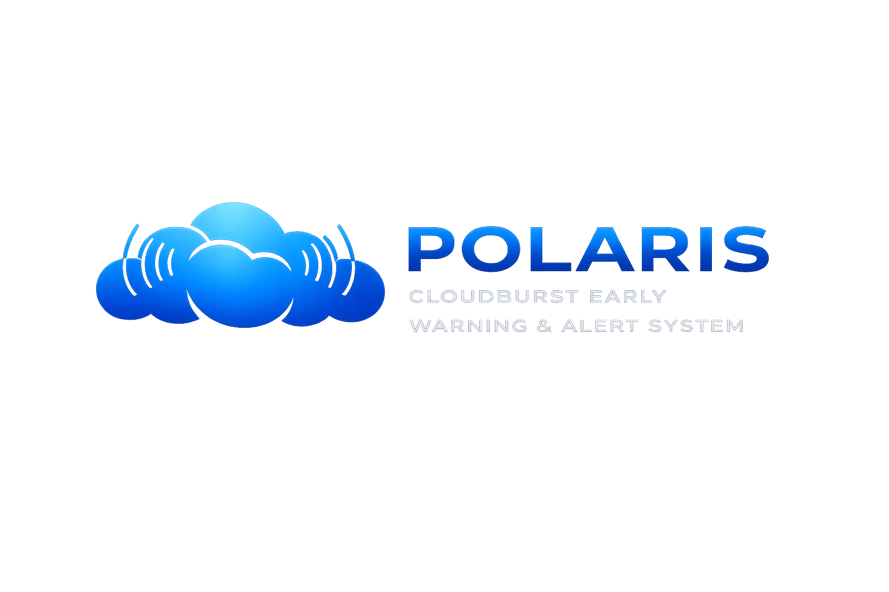

<div align="center">



| **Current Version** | `v0.9.B: Production Hardening, Secure Auth, and Release Readiness` |
| --- | --- |

</div>

---

> **An AI-powered, real-time, hyperlocal cloudburst early warning and decision system**  
> combining **computer vision**, **temporal intelligence**, and **human-in-the-loop authority**.

---

## Overview

**Polaris** is a research-grade early warning and decision platform designed to detect cloudburst-like risk before severe impact.
It combines:

- vision features from camera inputs
- temporal escalation modeling
- citizen-ground reports
- rule-based safety checks
- authority override controls

The result is a safety-first, explainable system built for operational decision support.

---

## Latest Branch Updates (Compared to v0.9.A)

The README now reflects the latest change set on this branch:

| Commit | Summary |
| --- | --- |
| `v0.9.B-sec-01` | Centralized backend runtime config with production startup validation for JWT, CORS, and debug/test toggles |
| `v0.9.B-sec-02` | Credential-backed JWT issuance and role-based authorization added for authority and ingest workflows |
| `v0.9.B-sec-03` | Authority, admin, debug, and mutating endpoints are now protected instead of being broadly open |
| `v0.9.B-sec-04` | Upload handling now sanitizes filenames, enforces image-only content types, and caps payload sizes |
| `v0.9.B-sec-05` | Repo hygiene tightened with ignored secrets, Firebase templates, safer local config handling, and a production checklist |
| `v0.9.B-sec-06` | Dashboard now gates protected operations behind authority sign-in and tolerates missing local `google-services.json` during setup |

## Production Checklist

See `PRODUCTION_CHECKLIST.md` for the release hardening and deployment checklist that goes with the new security model.

### v0.9.B Highlights

#### Production Hardening and Secure Operations

- Backend configuration now flows through environment-driven settings with explicit production validation.
- `POST /auth/token` now issues JWTs only after credential verification instead of acting as an open token mint.
- Authority, admin, debug, and mutating endpoints require bearer auth with role checks.
- Debug and test-notification routes are disabled in production by default.
- Camera and citizen image uploads now sanitize filenames, restrict content types, and enforce upload ceilings.
- MongoDB connectivity is sourced from environment configuration and verified during startup.

#### Secret and Repo Hygiene

- Local `.env`, Android Firebase config files, uploads, logs, caches, and build outputs are now ignored from git.
- Example onboarding files are provided for `.env` and Android Firebase configuration.
- A dedicated `PRODUCTION_CHECKLIST.md` now documents release hardening, secret rotation, and deployment expectations.

#### Notification Reliability

- FCM delivery now treats dispatch as success when at least one target succeeds.
- Permanent token failures are auto-deactivated in token storage.
- Delivery responses include `delivered_count`, `failed_count`, and `deactivated_tokens_count`.
- Dedup logic suppresses repeated alerts within `ALERT_DEDUP_SECONDS`.
- Failed alerts can be retried automatically by a background worker (`ALERT_RETRY_*` settings).

#### Web Push Stabilization

- Service worker readiness is enforced before requesting web FCM tokens.
- Web foreground duplicate popups are avoided by design.
- Service worker logic avoids duplicate manual notifications for notification payloads.
- Token registration diagnostics were improved for non-2xx backend responses.

#### Citizen App UX Revamp

- Citizen app now uses dashboard-aligned theme primitives for consistent cross-app UX.
- Dashboard information architecture was reduced to emergency-critical actions and live status.
- Report severity selection now exposes explicit visual severity coding via sliding segmented control.
- Android app entry experience now has branding parity across launcher, splash, and in-app startup loader.

#### Citizen API Connectivity

- Citizen app API configuration supports `POLARIS_API_BASE_URL` via compile-time env.
- Android emulator flow auto-resolves loopback hosts (`127.0.0.1` / `localhost`) to `10.0.2.2`.
- Web and non-Android runtime behavior keeps the configured base URL unchanged.

#### Help Request and Rescue Team Operations

- Citizen app help requests now persist through `POST /input/citizen/help-request`.
- Dashboard now includes a dedicated **Teams** tab for rescue operations.
- Authorities can assign teams to open help requests from dashboard workflows.
- Teams can be tracked on the map with live request overlays.
- Nearby-team notification workflow is available for open requests with location.
- Team operations include counts, responders, assignment state, and notification stats.

#### Deployment and Tooling

- Firebase hosting config files were added (`firebase.json`, `.firebaserc`, workflows).
- Notification-path verification and phone-proxy tooling were introduced for reliability testing.

---

## App UI Demos

<div align="center">
  <table>
    <tr>
      <td align="center"><b>Dashboard App</b></td>
      <td align="center"><b>Citizen App</b></td>
    </tr>
    <tr>
      <td></td>
      <td></td>
    </tr>
  </table>
</div>

---

## System Architecture

```text
Camera / Images
  -> Image Feature Extraction (brightness, entropy, edges)
  -> Rule-Based Risk Logic
  -> Time-Series Spike Detection
  -> CNN (spatial model)
  -> LSTM (temporal model)
  -> Citizen Input Fusion
  -> Safety-First Final Decision (with authority override support)
  -> Auto Alert Dispatch (FCM)
  -> MongoDB + Dashboard / Map APIs
```

---

## Key Capabilities

### Vision and Temporal Intelligence

- CNN-based visual pattern detection for high-risk sky conditions
- LSTM-based temporal escalation detection
- Ensemble scoring with rule + CNN + temporal + trend + feedback signals

### Human-in-the-Loop Controls

- authority override with auditable metadata
- citizen image and water-level inputs
- authority feedback ingestion for model improvement

### Active Learning and ML Admin Controls

- uncertain sample queue and labeling-aware loop
- admin retrain-and-reload pipeline
- auto-training configuration controls

### Dashboard and Map Experience

- live status, risk, confidence, and ETA trends
- map overlays for live risk, safe zones, and historical events
- mobile-friendly UI updates for compact Android usage
- rescue-team operations tab with assignment + nearby notifications + team stats

---

## Notification and Alert Routing (v0.9.B)

- Alert dispatch is handled through **Firebase Cloud Messaging (FCM)** only.
- Auto-dispatch is triggered directly from the decision pipeline in `app/main.py`.
- Valkey publication remains available for compatibility workflows.
- Manual override remains authoritative over automated decisions.

### Supported Dispatch Channels

- `APP_NOTIFICATION`
- `PUSH_NOTIFICATION`
- `PUSH_SMS`
- `SMS_SIREN`
- `ALL_CHANNELS`

### Required Environment Variables

- `POLARIS_JWT_SECRET`
- `POLARIS_AUTH_USERNAME`
- `POLARIS_AUTH_PASSWORD`
- `FCM_PROJECT_ID`
- `FCM_SERVICE_ACCOUNT_FILE` (absolute or repo-relative path to Firebase Admin SDK JSON)

### Optional Target and Merge Variables

- `FCM_DEVICE_TOKENS` (comma-separated direct tokens)
- `FCM_TOPIC` (topic target such as `polaris-alerts`)
- `FCM_INCLUDE_ENV_TOKENS` (`1` to include `.env` tokens even when DB tokens exist)

### Reliability Controls

- `ALERT_DEDUP_SECONDS` (duplicate suppression window; code default `180`)
- `ALERT_RETRY_ENABLED` (default `1`)
- `ALERT_RETRY_INTERVAL_SECONDS` (default `30`)
- `ALERT_RETRY_MAX_ATTEMPTS` (default `3`)
- `ALERT_RETRY_BATCH_SIZE` (default `20`)

### Token and Debug Endpoints

- `POST /alert/register-token`
- `POST /alert/unregister-token`
- `POST /auth/token`
- `POST /alert/test-token` (authority token required; disabled in production by default)
- `GET /alert/debug-status` (authority token required; disabled in production by default)

### Security Notes

- Treat previously committed Firebase config files and local `.env` values as exposed and rotate associated secrets outside the repo.
- Use `.env.example` as the onboarding template. Keep the real `.env` local or inject it via deployment secrets.
- Keep Android Firebase config local only:
  - `polaris_dashboard/android/app/google-services.json`
  - `polaris_citizen/android/app/src/google-services.json`
- Protected authority APIs now require `Authorization: Bearer <token>` from `POST /auth/token`.

---

## API Snapshot

### Core Inference and Alerting

- `POST /input/camera` (protected; ingest/authority token required)
- `GET /decision/latest`
- `POST /alert/dispatch` (protected)
- `GET /backend/health`
- `POST /backend/start` (protected)

### Dashboard and Visualization

- `GET /dashboard/current-status`
- `GET /dashboard/risk-timeseries`
- `GET /dashboard/confidence-timeseries`
- `GET /dashboard/eta-timeseries`
- `GET /alerts/latest`
- `GET /alerts/history`
- `GET /map/live-risk`
- `GET /map/safe-zones`
- `GET /map/historical-events`
- `GET /predictions/history`

### Citizen and Authority Flows

- `POST /input/citizen/image`
- `POST /input/citizen/water-level`
- `POST /input/citizen/help-request`
- `GET /input/citizen/help-request/{request_id}`
- `GET /input/citizen/pending` (protected)
- `POST /input/citizen/review` (protected)
- `GET /dashboard/help-requests` (protected)
- `GET /dashboard/teams/snapshot` (protected)
- `POST /dashboard/teams/upsert` (protected)
- `POST /dashboard/help-requests/{request_id}/assign-team` (protected)
- `POST /dashboard/help-requests/{request_id}/notify-nearby` (protected)
- `POST /override/set` (protected)
- `POST /override/clear` (protected)
- `GET /override/history` (protected)
- `GET /override/active` (protected)
- `POST /authority/feedback/` (protected)
- `GET /authority/feedback/active-learning/queue` (protected)
- `GET /authority/feedback/active-learning/stats` (protected)

### ML Admin

- `POST /admin/ml/retrain-and-reload` (protected)
- `GET /admin/ml/status` (protected)
- `GET /admin/ml/auto-config` (protected)
- `POST /admin/ml/auto-config` (protected)

---

## Quick Start (Local)

### Backend

```bash
cp .env.example .env
python -m venv .venv
# activate venv for your shell
pip install -r requirements.txt
uvicorn app.main:app --host 0.0.0.0 --port 8000 --reload
```

### Flutter Dashboard

```bash
cd polaris_dashboard
flutter pub get
flutter run -d chrome --dart-define=POLARIS_API_BASE_URL=http://127.0.0.1:8000
```

The dashboard now opens with an authority sign-in screen.
You can enter backend credentials there, or still prefill them with:
`--dart-define=POLARIS_AUTH_USERNAME=...`
`--dart-define=POLARIS_AUTH_PASSWORD=...`

### Flutter Citizen App

```bash
cd polaris_citizen
flutter pub get
flutter run --dart-define=POLARIS_API_BASE_URL=http://127.0.0.1:8000
```

> On Android emulator, loopback API hosts are mapped internally to `10.0.2.2`.
> On a physical Android phone, use your laptop LAN IP instead, for example `http://192.168.29.26:8000`, and make sure the backend is started with `--host 0.0.0.0`.
> Place local Firebase Android config files from the example paths before Android builds; they are intentionally gitignored.

---

## Project Structure

```text
Polaris/
  app/
    main.py
    database.py
    routes/
    notifications/
    utils/
    ai/
  polaris_dashboard/
  polaris_dataset/
  firebase.json
  public/
  README.md
```

---

## Technology Stack

| Layer | Technology |
| --- | --- |
| Backend | FastAPI |
| AI / ML | PyTorch, TorchVision |
| Computer Vision | OpenCV |
| Temporal Learning | LSTM |
| Database | MongoDB |
| Messaging | FCM, optional Valkey Pub/Sub |
| Frontend | Flutter (Web + Android) |
| Mapping | OpenStreetMap |
| Deployment | Firebase Hosting scaffold + cloud-ready backend |

---

## Team

<a href="https://github.com/HarshBavaskar/Polaris/graphs/contributors">
  
</a>

- **Detection, AI and Dashboard System** - *Harsh Bavaskar*
- **Warning and Notification System** - *Anisa D'souza*

---

## Project Status
[PHASE 1 COMPLETED]
- [x] Detection pipeline complete
- [x] CNN + LSTM integrated
- [x] Citizen and authority feedback loop
- [x] Manual override system live
- [x] Live dashboard and geospatial intelligence operational
- [x] FCM-based web/mobile notifications integrated
- [x] Alert dedup + retry reliability controls implemented

[PHASE 2]
- IOS Integration
- Hardware InTegration
- Cloud Deployment
- Login System Integration


---

## Future Roadmap

- automated safe-zone verification and confidence decay
- hyperlocal sensor fusion
- multi-camera zone mapping
- pilot deployments with local authorities

---

## Disclaimer

Polaris is an **early warning support system** and does not replace official meteorological agencies.  
It is intended to assist disaster response with faster, hyperlocal insights.

---

> *Polaris aims to detect danger early, when response still matters.*
